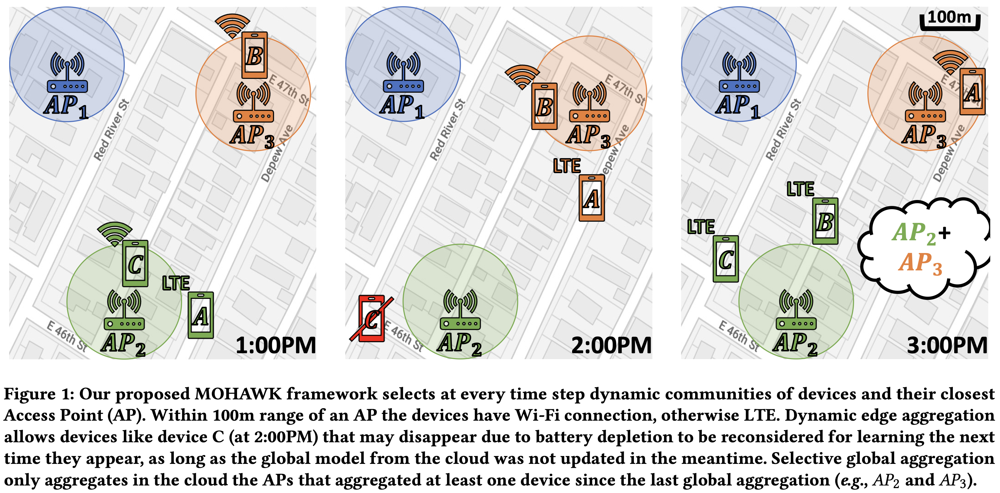

# [MOHAWK: Mobility and Heterogeneity-Aware Dynamic Community Selection for Hierarchical Federated Learning](https://dl.acm.org/doi/abs/10.1145/3576842.3582378) (IoTDI 2023)

Allen-Jasmin Farcas, Myungjin Lee, Ramana Rao Kompella, Hugo Latapie, Gustavo De Veciana, Radu Marculescu

Contact: allen.farcas@utexas.edu

<div align="center">
    <a href="./">
        
    </a>
</div>

## 1. Prepare environment

```bash
conda create -n mohawk python==3.10
conda activate mohawk
pip3 install torch torchvision torchaudio --index-url https://download.pytorch.org/whl/cu118
pip install paramiko scp tqdm pandas
```

## 2. Prepare mobility data

Download the mobility dataset from [here](https://drive.google.com/file/d/1sFOMHPZOCiVKCVQAVubxyEApXWu-eU81/view?usp=share_link).
Unzip the downloaded file under the `mobility_data` folder such that you have the following structure:

```
mobility_data
--- data_prepare.py
--- mobility_utils.py
--- RVF_ATX_PID_HZ-2020-05.tsv
--- RVF_ATX_PID_HZ_Places_Lookup.tsv
```

Then, execute the following:

```bash
cd mobility_data
python data_prepare.py
```

## 3. Prepare datasets

Run `python generate_dataset.py` to create the local datasets for all users.

## 4. Change paths

In `utils.py` the function `get_hw_info` contains paths for the files. Change them accordingly. The username and
password only really matter if you run experiments on real devices. If you use only simulation you can leave any
placeholder text there, but the path for the files needs to be completed.

You need to match the `hw_type` from `get_hw_info(hw_type)` with `device_type` from `exp0.bash` and if the added path
is `home/user/MOHAWK/files` then in `exp0.bash` use `cloud_path="files"`.

## 4.5. Doing some chicanery

So the train function in utils has a dataloader that causes a deadlock for num_workers > 0. I set it to 0 but I'm
unsure of how this will affect the process. In the bash, change cuda limit per gpu to however many devices you're training unless you have more than one GPU. My default is 10 devices on 100 users and 100 aps, re-run the data_prepare with 100 devices and generate_dataset with num users as 100 to make the default work. try to experiment with how many devices you can run on your machine. Look into how the num_workers actually works since I think it affects the distributed learning process.

TODO:

- [x] Figure out how to use num_workers in the dataloader
  - Allen recommends between 1 and 2
- [x] Figure out how to set the number of rounds, the default is 744, idk how to reduce that yet:
  - You can change the _myrange_ variable in [cloud.py] to reduce the number of rounds, default is the number of timesteps in a day for the mobility data, which is 744 rounds.
- [ ] Add networkx and create a graph of the devices and their connections
- [ ] Implement dropout, stragglers, and battery life

Notes from Meeting:

- [ ] Refine the upload speed slide, make three key points and make it more concise
- [ ] Finalize how we model power, can use the communication energy model from the MOHAWK paper, find parameters to finalize the equation. Additionaly can add depletion for training time, but he's fine with that not being there.
- [ ] To simulate node dropout, we still have to finish the training and add it to the t.join in the cloud. To dropout, we just won't include the training results in the aggregation. But definitely finish training it each time anyway or we'll have hanging threads.
- [ ] The assert is not is supposed to be like that, we need to change it back to != in the _run_ function
- [ ] Refresh in minds the setup or recap of M1 or if we changed a lot just re-establish it (1 slide)
- [ ] Have results of testing
- [ ] Compare dropout performance with baseline of no dropout
- [ ] For dropout random for M2 and to simmulate what would happen given battery lives and unstable connections, market it in terms of unstable connections
- [ ] Reference above situations in battery depletion and communication-based dropout in the methodology section
- [ ] If battery level is beyond a threshold device drops or if comm time takes too long (over time threshold), then device also drops
- [ ] If we do not get to simulate the death by comm bandwidth and battery, mention that we will have it in the report but not in this specific implementation
- [ ] Have a setting slide before methodology, mention how devices are connected, testing parameters, how many look every comm round, dataset, model, mention iid or non-iid dataset. Mention type of dataset
- [ ] Have a results page and a future works page (globally one does really well and one does much worse). Mention what we want to explore in M3. Mention at least 1 technique to leverage in M3. FIGURE OUT HOW TO DO IT
- [ ] X axis (comm round pref 50), Y axis (global model accuracy on MNIST)

## 5. Run experiments

Edit the experiment configuration `experiments/exp0.bash`. Check the simulation.py for more details on the parameters used.

Run `bash experiments/exp0.bash` to start the experiment

## Citation

```
@inproceedings{farcas2023mohawk,
  title={MOHAWK: Mobility and Heterogeneity-Aware Dynamic Community Selection for Hierarchical Federated Learning},
  author={Farcas, Allen-Jasmin and Lee, Myungjin and Kompella, Ramana Rao and Latapie, Hugo and De Veciana, Gustavo and Marculescu, Radu},
  booktitle={Proceedings of the 8th ACM/IEEE Conference on Internet of Things Design and Implementation},
  pages={249--261},
  year={2023}
}
```
